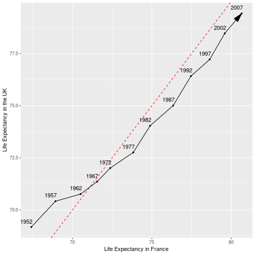

# Intro

For this assignment, we have been tasked with selecting and completing two tasks. The first will be a data reshaping problem, while the second will be a data joining problem.

# Data Reshaping (Prompt #2)

Let's make a table comparing life expectancies between the UK and France over the years sampled in the `gapminder` dataset. Specifically, we want each row to represent a year and have a column for each country that records life expectancy in that year.


```r
FR_UK <- gapminder %>%
  filter(country == "United Kingdom" | country == "France") %>%
  select(year, lifeExp, country) %>%
  spread(country, lifeExp)
```

## Tabulate Data


```r
FR_UK %>%
  kable(col.names = c("Year",
                      "Life Expectancy in France",
                      "Life Expectancy in the UK"))
```


| Year| Life Expectancy in France| Life Expectancy in the UK|
|----:|-------------------------:|-------------------------:|
| 1952|                    67.410|                    69.180|
| 1957|                    68.930|                    70.420|
| 1962|                    70.510|                    70.760|
| 1967|                    71.550|                    71.360|
| 1972|                    72.380|                    72.010|
| 1977|                    73.830|                    72.760|
| 1982|                    74.890|                    74.040|
| 1987|                    76.340|                    75.007|
| 1992|                    77.460|                    76.420|
| 1997|                    78.640|                    77.218|
| 2002|                    79.590|                    78.471|
| 2007|                    80.657|                    79.425|

Looks good, but it's hard to tell how life expectancy in the UK is changing relative to France. Let's use a path plot to get a better sense of this.

## Plot Data


```r
FR_UK %>%
  ggplot(aes(France, `United Kingdom`)) +
    geom_abline(slope = 1, intercept = 0, colour = "red", linetype = "dashed") +
    geom_path(arrow = arrow(type = "closed", angle = 15)) +
    geom_point(size = 1) +
    geom_text(aes(label = year),hjust = 0.9, vjust = -0.9) +
    labs(x = "Life Expectancy in France", y = "Life Expectancy in the UK")
```



Now it is clear that the UK used to have a slightly higher life expectancy, but France overtook them in 1967. That being said, the life expectancies of both countries appear to be steadily increasing over the sampling period.

# Data Joining (Prompt #1)

In this task, we want to build a dataset to compliment the `gapminder` set and consider different ways of joining these datasets... But that seems like a lot of effort for not much benefit. Instead, let's play with the `world.cities` dataset from the `maps` package.


```r
head(world.cities)
```

```
##                 name country.etc   pop   lat  long capital
## 1 'Abasan al-Jadidah   Palestine  5629 31.31 34.34       0
## 2 'Abasan al-Kabirah   Palestine 18999 31.32 34.35       0
## 3       'Abdul Hakim    Pakistan 47788 30.55 72.11       0
## 4 'Abdullah-as-Salam      Kuwait 21817 29.36 47.98       0
## 5              'Abud   Palestine  2456 32.03 35.07       0
## 6            'Abwein   Palestine  3434 32.03 35.20       0
```

## Some Mutating Joins

Let's add the name of the capital city to the gapminder dataset using left/right joins. These joins keep all the rows from one side (here `gapminder`) and columns from both.


```r
world.cities %>%
  filter(capital == 1) %>%
  select(country = country.etc, capital = name) %>%
  right_join(gapminder) %>%
  filter(year == 2007, continent == "Asia") %>% # Let's restrict our output to smaller subset
  select(country, capital, lifeExp) %>%
  kable(col.names = c("Country", "Capital City", "Life Expectancy in 2007"))
```


|Country            |Capital City | Life Expectancy in 2007|
|:------------------|:------------|-----------------------:|
|Afghanistan        |Kabul        |                  43.828|
|Bahrain            |Manama       |                  75.635|
|Bangladesh         |Dhaka        |                  64.062|
|Cambodia           |Phnum Penh   |                  59.723|
|China              |Beijing      |                  72.961|
|Hong Kong, China   |NA           |                  82.208|
|India              |Ni Dilli     |                  64.698|
|Indonesia          |Jakarta      |                  70.650|
|Iran               |Tehran       |                  70.964|
|Iraq               |Baghdad      |                  59.545|
|Israel             |Jerusalem    |                  80.745|
|Japan              |Tokyo        |                  82.603|
|Jordan             |'Amman       |                  72.535|
|Korea, Dem. Rep.   |NA           |                  67.297|
|Korea, Rep.        |NA           |                  78.623|
|Kuwait             |al-Kuwayt    |                  77.588|
|Lebanon            |Bayrut       |                  71.993|
|Malaysia           |Kuala Lumpur |                  74.241|
|Mongolia           |Ulaanbaatar  |                  66.803|
|Myanmar            |Rangoon      |                  62.069|
|Nepal              |Kathmandu    |                  63.785|
|Oman               |Muscat       |                  75.640|
|Pakistan           |Islamabad    |                  65.483|
|Philippines        |Manila       |                  71.688|
|Saudi Arabia       |Riyadh       |                  72.777|
|Singapore          |Singapore    |                  79.972|
|Sri Lanka          |Colombo      |                  72.396|
|Syria              |Damascus     |                  74.143|
|Taiwan             |Taipei       |                  78.400|
|Thailand           |Bangkok      |                  70.616|
|Vietnam            |Ha Noi       |                  74.249|
|West Bank and Gaza |NA           |                  73.422|
|Yemen, Rep.        |NA           |                  62.698|

As you can see, we don't have city information for all countries in the `gapminder` set. If we want to drop those incomplete rows from the dataset, we can use an inner join instead:


```r
world.cities %>%
  filter(capital == 1) %>%
  select(country = country.etc, capital = name) %>%
  inner_join(gapminder) %>%
  filter(year == 2007, continent == "Asia") %>% # Let's restrict our output to smaller subset
  select(country, capital, lifeExp) %>%
  kable(col.names = c("Country", "Capital City", "Life Expectancy in 2007"))
```


|Country      |Capital City | Life Expectancy in 2007|
|:------------|:------------|-----------------------:|
|Jordan       |'Amman       |                  72.535|
|Iraq         |Baghdad      |                  59.545|
|Thailand     |Bangkok      |                  70.616|
|Lebanon      |Bayrut       |                  71.993|
|China        |Beijing      |                  72.961|
|Sri Lanka    |Colombo      |                  72.396|
|Syria        |Damascus     |                  74.143|
|Bangladesh   |Dhaka        |                  64.062|
|Vietnam      |Ha Noi       |                  74.249|
|Pakistan     |Islamabad    |                  65.483|
|Indonesia    |Jakarta      |                  70.650|
|Israel       |Jerusalem    |                  80.745|
|Afghanistan  |Kabul        |                  43.828|
|Nepal        |Kathmandu    |                  63.785|
|Malaysia     |Kuala Lumpur |                  74.241|
|Bahrain      |Manama       |                  75.635|
|Philippines  |Manila       |                  71.688|
|Oman         |Muscat       |                  75.640|
|India        |Ni Dilli     |                  64.698|
|Cambodia     |Phnum Penh   |                  59.723|
|Myanmar      |Rangoon      |                  62.069|
|Saudi Arabia |Riyadh       |                  72.777|
|Singapore    |Singapore    |                  79.972|
|Taiwan       |Taipei       |                  78.400|
|Iran         |Tehran       |                  70.964|
|Japan        |Tokyo        |                  82.603|
|Mongolia     |Ulaanbaatar  |                  66.803|
|Kuwait       |al-Kuwayt    |                  77.588|

What if we just want to know which countries we are missing city information for? For that filtering joins have got us covered.

## Filtering Joins

What we would like to do is filter one dataset based on rows in another dataset. In some situations we might only want to keep rows of the first dataset that have matches in the second (in which case we would use a semi join). However, here we want to see which rows in `gapminder` do not have matches in `world.cities`. For that we need the `anti_join` function.


```r
world.cities %>%
  filter(capital == 1) %>%
  select(country = country.etc) %>%
  anti_join(gapminder, .) %>% #Notice we can use periods to pipe in the previous line
                              #somewhere other than the first argument
  filter(year == 2007) %>%
  select(-year) %>%
  kable(col.names = c("Country", "Continent", "Life Expectancy in 2007", "Population in 2007", "GDP per Capita in 2007"))
```


|Country            |Continent | Life Expectancy in 2007| Population in 2007| GDP per Capita in 2007|
|:------------------|:---------|-----------------------:|------------------:|----------------------:|
|Congo, Dem. Rep.   |Africa    |                  46.462|           64606759|               277.5519|
|Congo, Rep.        |Africa    |                  55.322|            3800610|              3632.5578|
|Cote d'Ivoire      |Africa    |                  48.328|           18013409|              1544.7501|
|Hong Kong, China   |Asia      |                  82.208|            6980412|             39724.9787|
|Korea, Dem. Rep.   |Asia      |                  67.297|           23301725|              1593.0655|
|Korea, Rep.        |Asia      |                  78.623|           49044790|             23348.1397|
|Montenegro         |Europe    |                  74.543|             684736|              9253.8961|
|Serbia             |Europe    |                  74.002|           10150265|              9786.5347|
|Slovak Republic    |Europe    |                  74.663|            5447502|             18678.3144|
|United Kingdom     |Europe    |                  79.425|           60776238|             33203.2613|
|United States      |Americas  |                  78.242|          301139947|             42951.6531|
|West Bank and Gaza |Asia      |                  73.422|            4018332|              3025.3498|
|Yemen, Rep.        |Asia      |                  62.698|           22211743|              2280.7699|

Looks like we aren't actually missing all that many countries! If I was not so lazy, I would have written up those few missing lines up myself and completed our capital-augmented gapminder dataset.

